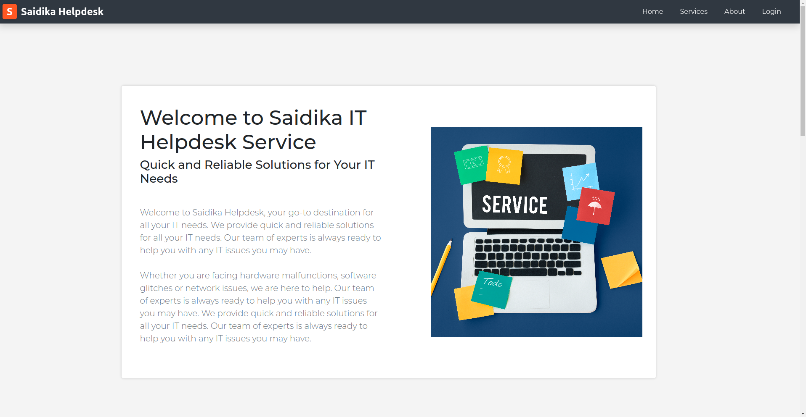

# Saidika Helpdesk

  

## Description

This is a Frontend project showcasing an IT helpdesk software solution that can be used in a corporate setting. My motivations for building it are to sharpen my skills with Frontend technologies, as well as to eventually be competent enough to contribute to a larger ecosystem of developers.

This project was inspired by challenges in previous employment, where there was no centralized customer support management. With this solution, enterprises can achieve streamlined ticketing and issue resolution, enhanced collaboration as well as scalability to handle incrasing customer queries.

## Installation

### Prerequisites
- Node.js (v14 or later)
- npm (v6 or later)

### Steps
1. Clone the repository: `git clone https://github.com/Jarabi/saidika-helpdesk.git`
2. Navigate to the project directory: `cd saidika-helpdesk`
3. Install dependencies: `npm install`
4. Start the development server: `npm run dev`
5. Open your browser and visit `http://localhost:3000` to see the project running.

## Usage instructions

With the server running, visit `http://localhost:3000`. You will be on the landing page:

You can use the navigation to view the other pages.

### Logging In

On the navigation, click on 'Login' to navigate to the login page:

Visit [Render](https://saidika-helpdesk-backend.onrender.com/users) where the API of this project is hosted. You will see a list of user objects. Use any email and password.

> Note: Users with `roleId` "200" have Admin rights, while those with "100" are regular users.

## License

This project is licensed under [MIT](https://github.com/Jarabi/saidika-helpdesk/blob/main/LICENSE)

## How to Contribute

Contributions are welcome. If you'd like to contribute to this project, please follow these guidelines:

1. Fork the repository
2. Create a new branch: `git checkout -b my-feature`
3. Make your changes and commit them: `git commit -m 'Add some feature'`
4. Push to the branch: `git push origin my-feature`
5. Submit a pull request
